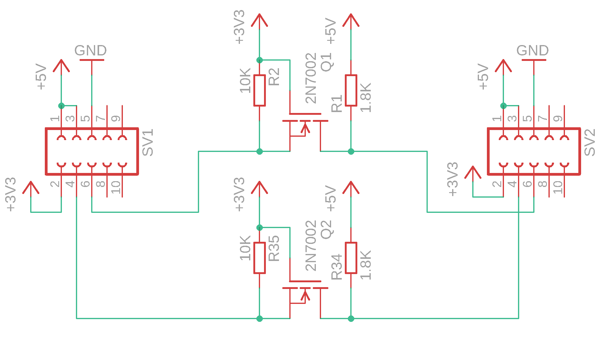
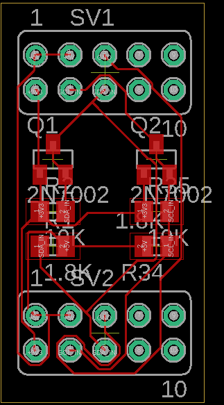
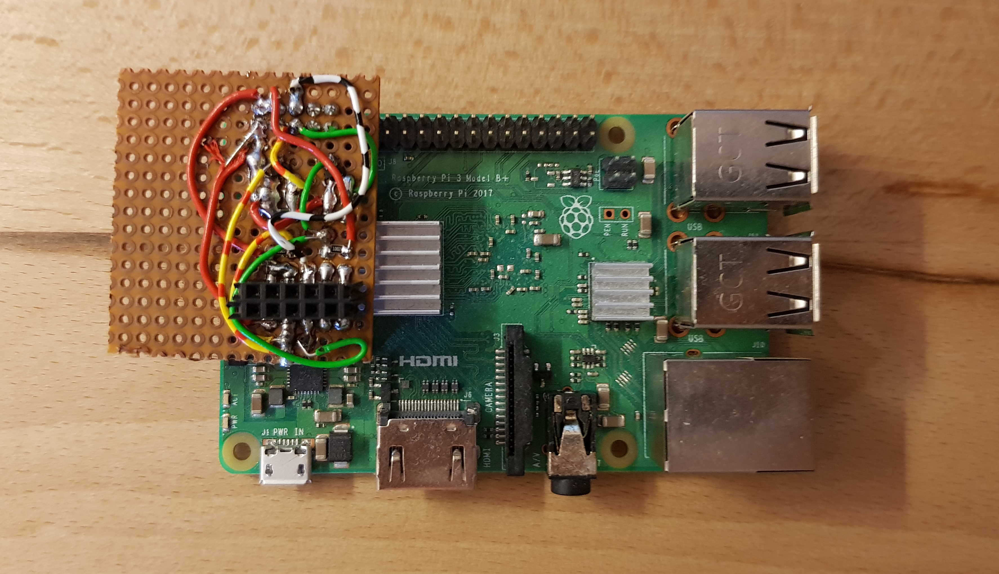
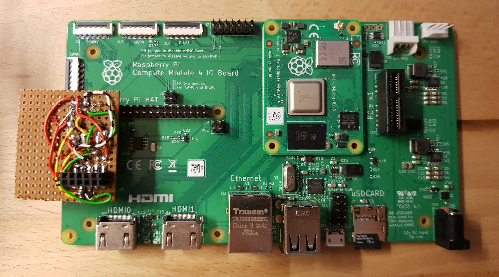
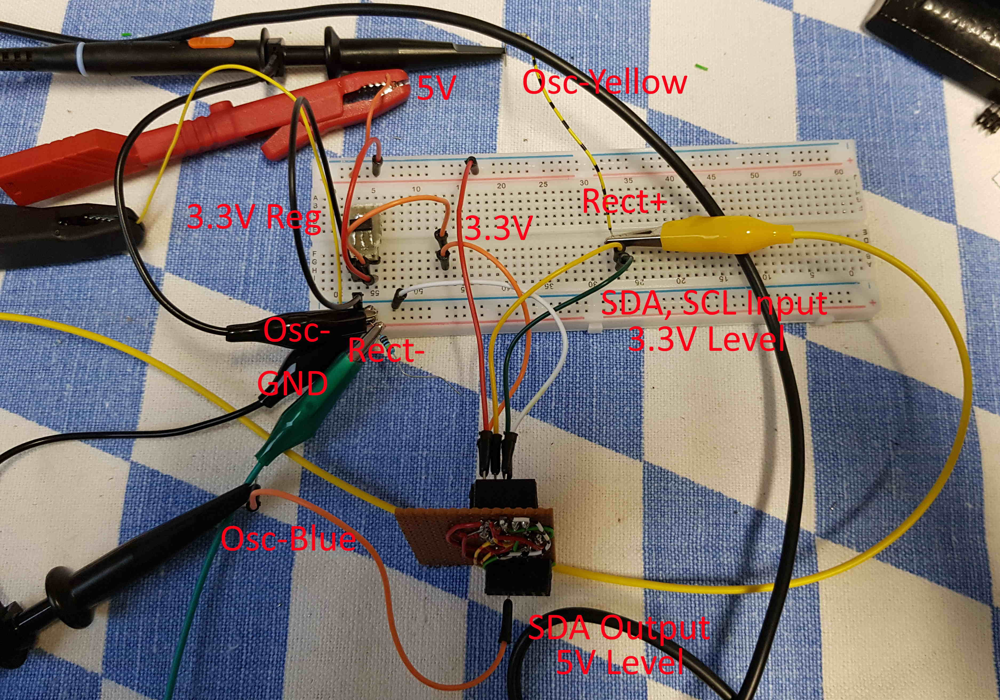
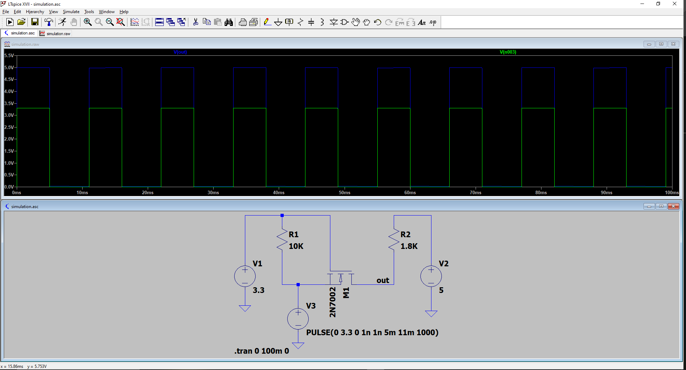

Raspberry Pi I²C Level-Shifter
==============================

A PiHAT for converting the Raspberry Pi I²C Signals from 3.3V levels to 5V levels, which is usefull if you want to interface with I²C-components that use 5V voltage levels. The project aims to save time in wiring up an external level-shifter and just plug a shield on top of the gpio pins of the Raspberry Pi.

## Schematics, Layout

 

 

## Application

This is how the module is supposed to be used:

On Raspberry Pi 3B+:

 

On Raspberry Pi Compute Module 4 IO Board:

 

## Testing

I tested the pcb, however and hand-soldered everything (which I can definitely not recommend). Everything is soldered exactly like in the schematic, even though I placed some parts differently.

Here is how my prototype looks like:

 

 
And here are my oscilloscope measurements on level shifting a rectangular pulse with the following frequencies:

40kHz:

 

200kHz:

 

500kHz (from here on it doesn't seem to be able to reach the full 5V):

 

And here a screenshot of the included LT-Spice simulation:

 

## Dependencies

2N7002 MOSFET library (lbr/transistors_gaui.lbr):
* http://eagle.autodesk.com/eagle/download/1129

## License

The project is licensed under the MIT-License. For further information see `LICENSE.md`.
