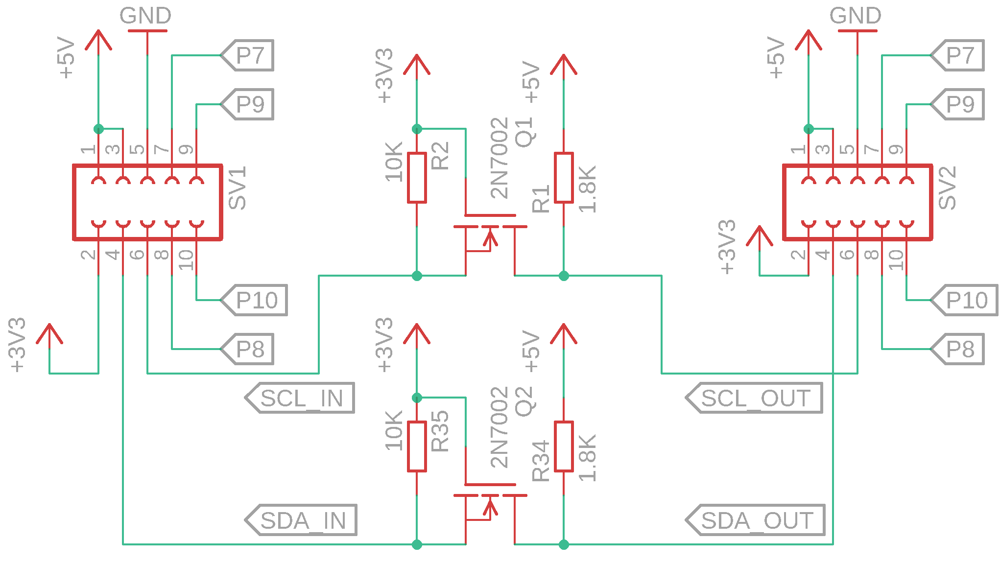
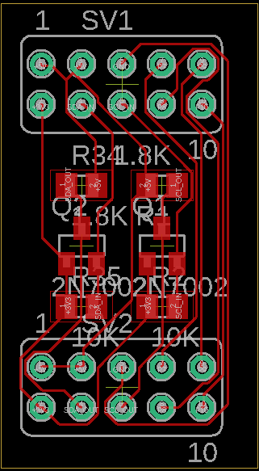

Raspberry Pi I²C Level-Shifter
==============================

A PiHAT for converting the Raspberry Pi I²C Signals from 3.3V levels to 5V levels, which is usefull if you want to interface with I²C-components that use 5V voltage levels. The project aims to save time in wiring up an external level-shifter and just plug a shield on top of the gpio pins of the Raspberry Pi.

## Schematics, Layout and PCB

 

 

 

## Dependencies

2N7002 MOSFET library (lbr/transistors_gaui.lbr):
* http://eagle.autodesk.com/eagle/download/1129

## License

The project is licensed under the MIT-License. For further information see `LICENSE.md`.
